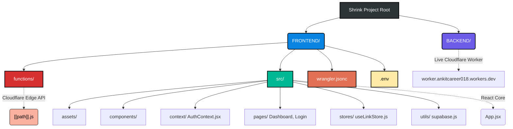

<div align="center">
  
  <h1>Shrink — Modern Edge URL Shortener</h1>
  <p><em>Lightning-fast, highly scalable, and privacy-focused URL shortening at the edge.</em></p>
  
  <p>
    <a href="https://shrink-pi.vercel.app"><strong>Explore the Platform »</strong></a> | 
    <a href="https://worker.ankitcareer018.workers.dev"><strong>Live Backend API »</strong></a>
  </p>

  <p>
    
    
    
    
    
  </p>
</div>

<br/>

Shrink is a highly scalable, edge-optimized URL Shortener built for extreme performance. Leveraging a modern JAMStack architecture, the application relies entirely on Cloudflare Edge Functions and Cloudflare KV for sub-millisecond global redirects, meaning zero cold starts and unparalleled speed.

## ✨ Key Features

* 🚀 **Ultra-Fast Edge Redirects**: Powered natively by Cloudflare KV directly at the edge, guaranteeing lightning-fast redirect speeds across the globe.
* 📊 **Advanced Edge Analytics**: Automatically captures device type (mobile, tablet, desktop), city, and country securely via Cloudflare's edge headers without relying on slow third-party IP lookups.
* 📱 **Client-Side QR Codes**: Instant, zero-latency QR code generation for shortened links rendered entirely within the browser.
* 🛡️ **Turnstile Protection**: Cloudflare Turnstile integration protects against bots seamlessly without intrusive captchas.
* 🔐 **Secure Authentication**: Fully integrated Supabase identity management for secure user accounts and historical link tracking.
* 🕒 **10-Minute Sessions**: Authenticated sessions automatically expire and sign out after 10 minutes, including after a page reload.
* 🍪 **Cookie Preferences**: Essential authentication and security cookies are supported, while optional cookie preferences can be managed from Cookie Settings. The platform does not use advertising cookies or sell personal data.
* 🔍 **Technical SEO Optimized**: Built-in Open Graph metadata, semantic HTML hierarchy, and optimized performance for high search engine visibility.
* ⚡ **Edge Caching**: Built-in Cache API integration to serve redirected links instantly from the nearest Cloudflare edge node without external environment bindings.
* 🧹 **Automated Link Cleanup**: Leverages Cloudflare Workers Cron Triggers (Scheduled tasks) to automatically purge soft-deleted links from the KV store on a rolling basis.
## ⚙️ Architecture & Folder Structure

The project uses a unified architecture where the React frontend and Cloudflare Edge API live seamlessly in the same repository. 



## 🛠️ How to Run Locally

To test the full stack (React UI + Cloudflare Edge API) on your local machine, run the following commands:

```bash
# 1. Navigate to the working directory
cd FRONTEND

# 2. Install dependencies
npm install

# 3. Run the complete environment (Vite UI + Wrangler Emulator)
npm run dev:full
```

> **Note**: Running `npm run dev:full` will instantly spin up both the Vite React app and the Cloudflare Wrangler emulator, ensuring the Edge API connects to your local simulated KV store seamlessly!

## 🔗 Environment Variables

To properly configure the application, ensure you have a `.env` and `.dev.vars` file in the `FRONTEND` directory with your Supabase credentials:

```env
# .env (For React/Vite)
VITE_SUPABASE_URL=https://your-project.supabase.co
VITE_SUPABASE_PUBLISHABLE_KEY=your-anon-key
VITE_API_URL=https://worker.ankitcareer018.workers.dev

# .dev.vars (For Cloudflare Edge Functions)
SUPABASE_URL=https://your-project.supabase.co
SUPABASE_ANON_KEY=your-anon-key
```

<hr/>
<div align="center">
  <p>Built with ❤️ for speed and privacy.</p>
</div>
